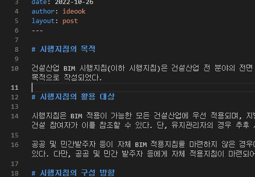
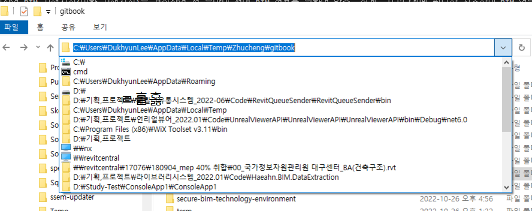

# 시행지침의 목적

건설산업 BIM 시행지침(이하 시행지침)은 건설산업 전 분야의 전면 BIM 적용을 위하여 발주, 설계, 시공단계에 필요한 최소한의 BIM 업무방법 및 절차 등의 세부 공통 실행방안을 제공하기 위한 목적으로 작성되었다.

# 시행지침의 활용 대상

시행지침은 BIM 적용이 가능한 모든 건설산업에 우선 적용되며, 지방자치단체, 공사 및 공단 등 공공 발주자, 민간 발주자(사업시행자)뿐만 아니라 건설사업관리기술인, 설계자, 시공자 등 모든 건설 참여자가 이를 참조할 수 있다. 단, 유지관리자의 경우 추후 시행지침\_유지관리자 편이 마련된 이후에 활용하도록 한다.

공공 및 민간발주자 등이 자체 BIM 적용지침을 마련하지 않은 경우에는 건설산업 BIM 기본지침(이하 기본지침)과 시행지침을 참조하여 각 발주자별 사업특성에 맞게 자체 적용지침을 마련할 수 있다. 다만, 공공 및 민간 발주자 등에게 자체 적용지침이 마련되어 있는 경우 기본지침과 시행지침에 준하여 자체 적용지침을 개정하여야 한다.

# 시행지침의 구성 방향

시행지침은 전면 BIM 적용 건설사업의 발주, 설계, 시공 업무와 관련하여 최소한의 BIM 수행 방법 및 절차 등의 세부 공통 지침을 제시할 수 있도록 구성한다.

전면 BIM 수행에 있어서, 주체별(발주자, 설계자, 시공자 등) 수행 업무 및 범위가 다르고, 발주 방식과 건설단계별로 BIM의 활용목적, 대상 및 수준 등이 상이하기 때문에 보다 명확한 BIM 업무방법 및 절차 등의 세부지침을 제공하기 위하여 발주자편, 설계자편, 시공자편으로구분하여 시행지침을 구성한다.

시행지침은 상위지침인 ‘건설산업 BIM 기본지침’의 선언적 BIM 적용원칙과 방향을 준용하여 작성되었다.

# 시행지침의 적용 효과

시행지침은 BIM 적용을 위한 공통 기준을 제시함으로써 공공 발주기관별로 적합한 BIM 적용 지침 개발을 지원할 뿐만 아니라 BIM 기반의 건설산업 데이터 통합 환경을 마련하는 데에 대한 근거를 제공할 수 있다.

시행지침은 전면 BIM 적용사업 수행에 있어서 발주자, 설계자, 시공자 등 모든 건설 참여자들이 최소한으로 갖춰야 할 요건(BIM 업무 방법과 절차 등)을 제시하고 있으므로 전면 BIM 수행 업무의 길잡이가 될 수 있다.

시행지침에서 BIM 관련 성과물 작성에 대한 공통 기준을 제시함으로써 BIM 데이터 및 성과품의 적절한 품질확보가 가능하다.
